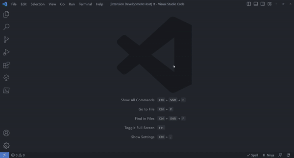

# IAP Cursor

Accelerate your coding **speed** with this extension.

## Table of contents

- [Notes](#notes)
- [Available Commands](#available-commands)
  - [Move](#move-commands)
  - [Select](#select-commands)
  - [Insert](#insert-commands)
  - [Delete](#delete-commands)
- [Snippets](#snippets)
- [Supported Settings](#supported-settings)
- [Examples](#examples)
  - [Move](#move-example)
  - [Previous Move](#previous-move)
  - [Select](#select-example)
  - [Insert](#insert-example)
  - [Delete](#delete-example)
  - [Combine](#combine-example)

## Notes

* You can deduce the behavior of the other commands from their names.
* By combining two or more commands (extension commands or Visual Studio Code built-in commands), you can create a new behavior or achieve a desired outcome. [See example](#combine-example)
* There are 23 commands available, which can be overwhelming to manually type each one. However, the extension provides some snippets that allows you to quickly insert the shortcuts for these commands, even one by one or all at once. [See example](#snippets) 

## Available Commands

### Move Commands

- `iap.cursorLeft`
- `iap.cursorRight`
- `iap.cursorUpLeft`
- `iap.cursorUpRight`
- `iap.cursorDownLeft`
- `iap.cursorDownRight`
- `iap.cursorPrevMove`

### Select Commands

- `iap.cursorLeftSelect`
- `iap.cursorRightSelect`
- `iap.cursorUpLeftSelect`
- `iap.cursorUpRightSelect`
- `iap.cursorDownLeftSelect`
- `iap.cursorDownRightSelect`
- `iap.cursorLineSelect`

### Insert Commands

- `iap.insertComma`
- `iap.insertCommaAndLineBefore`
- `iap.insertCommaAndLineAfter`
- `iap.insertSemicolon`
- `iap.insertSemicolonAndLineBefore`
- `iap.insertSemicolonAndLineAfter`

### Delete Commands

- `iap.deleteLineText`
- `iap.deleteLineAndGoUpRight`
- `iap.deleteLineAndGoDownRight`

## Snippets

There's 23 snippets, one for each command and they are from this format: `iap-|command name|`

examples: `iap-cursorLeft` • `iap-cursorDownRightSelect` • `iap-insertComma` • `iap-del-downRight`

or you can use this snippet `iap-all` for all the commands at once.



## Supported Settings

- `iap.prevMove` This is used to store previous move for future use with the `iap.cursorPrevMove` command • Automatically updated
- `iap.useSelectCommandsAsPrevMove`

## Examples

### Move Example

In your `keybindings.json` add the following shortcut:

```json
{
   "key": "ctrl+i u",
   "command": "iap.cursorUpRight",
   "when": "editorTextFocus"
}
```

Pressing `ctrl+i` followed by `u` will instantly move the cursor to the end of the top line.

### Previous Move

In your `keybindings.json` add the following shortcut:

```json
{
   "key": "ctrl+shift+i",
   "command": "iap.cursorPrevMove",
   "when": "editorTextFocus"
}
```

Instead of repeatedly pressing `ctrl+i` followed by `u` to move up and go to the end of the line again and again, you can now simply hold `ctrl+shift` and repeatedly press `i` to repeat the last used direction.

### Select Example

In your `keybindings.json` add the following shortcut:

```json
{
   "key": "ctrl+u j",
   "command": "iap.cursorRightSelect",
   "when": "editorTextFocus"
}
```

Pressing `ctrl+u` followed by `j` will select the text from the current cursor position to the end of the line.

### Insert Example

In your `keybindings.json` add the following shortcut:

```json
{
   "key": "ctrl+shift+;",
   "command": "iap.insertSemicolonAndLineAfter",
   "when": "editorTextFocus"
}
```

Pressing `ctrl+shift+;` will instantly insert a semicolon at the end of the current line and create a new line below it.

### Delete Example

In your `keybindings.json` add the following shortcut:

```json
{
   "key": "shift+delete",
   "command": "iap.deleteLineAndGoUpRight",
   "when": "editorTextFocus"
}
```

Pressing `shift+delete` will delete the current line and position the cursor at the end of the next line.

### Combine Example

In your `keybindings.json` add the following shortcut:

```json
{
   "key": "ctrl+; m",
   "command": "runCommands",
   "args": {
      "commands": [
         "iap.insertSemicolon",
         "iap.cursorDownRight"
      ]
   },
   "when": "editorTextFocus",
}
```

Pressing `ctrl+;` followed by `m` will insert a semicolon at the of the current line and the cursor will move to the end of the next line.

## The End

Thank you for exploring our extension!

We hope that our extension enhances your coding speed in Visual Studio Code. If you have any feedback, suggestions, or encounter any issues, we would love to hear from you. Feel free to open an issue on our GitHub repository.

Happy coding and enjoy using our extension!